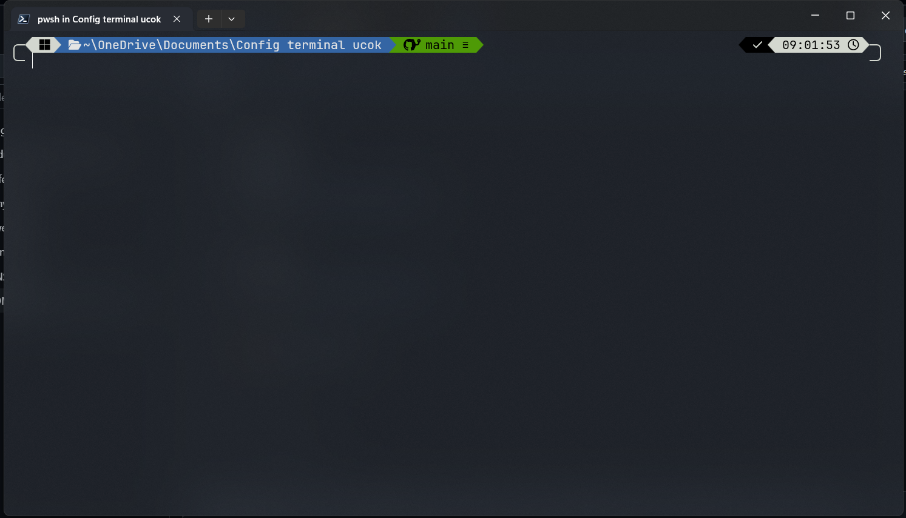
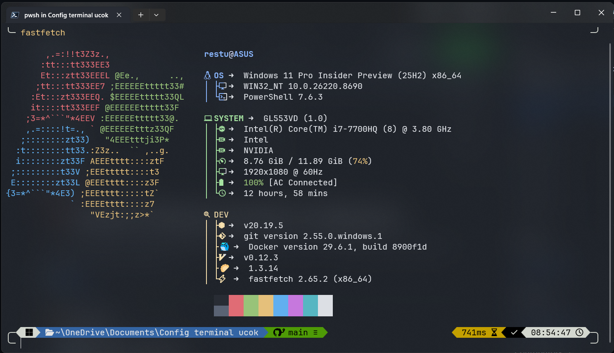

<div align="center">

# ⚡ Windows Developer Terminal Setup

A modern Windows terminal configuration inspired by **HyDE Linux**, **Powerlevel10k**, and **modern developer environments**.

Designed for developers who want a clean, beautiful, and productive PowerShell experience.

<br>


</div>

---

# 📖 Overview

This repository contains my personal Windows terminal configuration.

It includes everything needed to transform a fresh Windows installation into a modern Linux-like developer terminal.

The goal is to provide a clean, fast, and highly customizable PowerShell environment for Windows developers.

---

# ✨ Features

- 🪟 Modern Windows PowerShell setup
- ⚡ PowerShell 7 configuration
- 🎨 Oh My Posh custom theme
- 📦 Fastfetch custom configuration
- 📁 Terminal Icons
- 🚀 Eza integration
- 🌳 Tree view aliases
- 🎯 Git integration
- 🐳 Docker detection
- 🥟 Bun detection
-  Neovim detection
- 🟢 Node.js detection
- 🌿 Beautiful developer prompt
- 🎨 Nerd Font support

---

# 📸 Preview

## PowerShell



---

## Fastfetch



---

# 📂 Repository Structure

```
.config
├── fastfetch/
│   └── config.jsonc
│
├── ohmyposh/
│   └── restu.omp.json
│
├── powershell/
│   └── Microsoft.PowerShell_profile.ps1
│
├── Modules/
│   └── Terminal-Icons/
│
screenshots/
│
README.md
LICENSE
```

---

# 📦 Included Configurations

## ⚡ PowerShell

- PowerShell 7
- PSReadLine
- Custom aliases
- Better command history
- Auto suggestions
- Modern prompt

---

## 🎨 Oh My Posh

Custom Powerlevel10k inspired theme.

Features

- Git Status
- Current Path
- Execution Status
- Time
- Programming Languages
- Modern Powerline Prompt

---

## 📦 Fastfetch

Custom Fastfetch layout inspired by HyDE Linux.

Displays

- Operating System
- Kernel
- Shell
- CPU
- GPU
- Memory
- Disk
- Display
- Battery
- Uptime

Developer tools

- Node.js
- Git
- Docker
- Bun
- Neovim
- Fastfetch

---

## 📁 Terminal Icons

Adds beautiful Nerd Font icons to

- Files
- Folders
- Git repositories
- File types

---

# 🚀 Installation

## 1. Install PowerShell 7

```powershell
winget install Microsoft.PowerShell
```

---

## 2. Install Oh My Posh

```powershell
winget install JanDeDobbeleer.OhMyPosh
```

---

## 3. Install Fastfetch

```powershell
winget install Fastfetch-cli.Fastfetch
```

---

## 4. Install Terminal Icons

```powershell
Install-Module Terminal-Icons -Repository PSGallery
```

---

## 5. Install Eza

```powershell
winget install eza-community.eza
```

---

## 6. Install Nerd Font

Recommended

- CaskaydiaCove Nerd Font
- JetBrainsMono Nerd Font
- MesloLGS Nerd Font

---

# 📋 Optional Software

These tools are automatically detected by Fastfetch.

| Software | Required |
|----------|----------|
| Git | ✅ |
| Node.js | Optional |
| Bun | Optional |
| Docker Desktop | Optional |
| Neovim | Optional |
| Fastfetch | Optional |

---

# ⚙️ Applying Configuration

Clone the repository

```bash
git clone https://github.com/restuusgh/config-powershell.git
```

Copy the files

```powershell
Copy-Item .config\fastfetch "$HOME\.config\" -Recurse -Force

Copy-Item .config\ohmyposh "$HOME\.config\" -Recurse -Force

Copy-Item .config\powershell\Microsoft.PowerShell_profile.ps1 `
"$HOME\Documents\PowerShell\" `
-Force
```

Restart PowerShell.

---

# 🖥 Requirements

- Windows 11
- Windows Terminal
- PowerShell 7
- Nerd Font

---

# 🎯 Recommended Applications

- Visual Studio Code
- Git
- Docker Desktop
- Bun
- Node.js
- Neovim
- Windows Terminal

---

# 🎨 Inspired By

- HyDE Linux
- Powerlevel10k
- Catppuccin
- Windows Terminal
- Oh My Posh

---

# ❤️ Contributing

Feel free to fork this repository and customize it to fit your own workflow.

Pull requests are welcome.

---

# 📄 License

MIT License

---

<div align="center">

Made with ❤️ by **Restu Singgih**

If you like this project, don't forget to ⭐ the repository.

</div>
